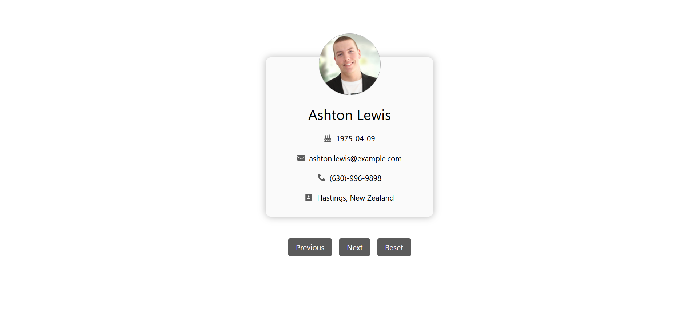

# Data Fetcher

## Description

This project is a react app to fetch data from an API.

## Things I learnt by creating this project :-

- How to use `useState` and `useEffect` hooks
- What is `Axios` and how to fetch data from an API
- How to store data inside browser's `local storage`

### Preview of the project :-

### [Live link](https://data-fetcher-app.vercel.app/) of the project.
